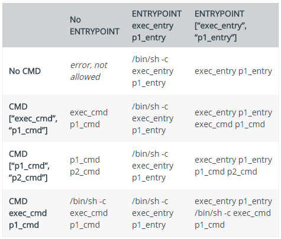

# Dockerfile
DockerFile是用于构建Docker镜像的文件

## 指令
1. FROM：继承基础镜像
2. MAINTAINER：镜像制作人的信息，已废弃
3. LABEL：给镜像添加标签
4. RUN：执行shell命令
5. EXPOSE：暴露端口号
6. CMD：容器启动的默认命令或参数
7. ENTRYPOINT：启动容器真正执行的命令
8. VOLUME：创建一个匿名挂载点
9. ENV：配置环境变量
10. ADD：复制文件、目录、URL到镜像，如果复制tar包，会自动解压
11. COPY：复制文件、目录到镜像，不支持URL，不支持解压，能用于多阶段构建
12. WORKDIR：设置容器的工作目录
13. USER：容器使用的用户
> CMD与ENTRYPOINT必须存在至少一个，同时存在时，CMD会成为ENTRYPOINT的参数。CMD可以被命令行参数覆盖，ENTRYPOINT可以被命令行选项覆盖。

## 多阶段构建
```dockerfile
FROM golang:1.19 as builder
ENV GOPROXY=https://goproxy.cn,direct
WORKDIR /build-dir
ADD ./go.mod /build-dir/go.mod
RUN go mod download
ADD . /build-dir
RUN CGO_ENABLED=0 GOOS=linux GOARCH=amd64 go build -o app cmd/main.go

FROM alpine
COPY --from=builder /usr/share/zoneinfo/Asia/Shanghai /etc/localtime
COPY --from=builder /build-dir/app /app
ENTRYPOINT ["/app"]
```

## 容器命令
