## Git多人开发的分支管理

### 一.前言

与SVN不同，由于Git的分支是本质上是一个指向变化的指针，所以Git的分支和切换速度是极其迅速的，因此Git是鼓励开发人员在开发的过程中大量使用分支的。

笔者在使用Git的过程中发现Git多人分支管理是非常艰深晦涩的，在查阅大量资料后，特此将其整理为一篇文章，便于复习和查阅， 也方便大家学习。

---

### 二.分支的基本使用

#### 1.什么是分支（branch）

假设团队中有多人在同时开发一个项目。同事A今天完成了50%的进度，此时如果他选择提交代码，由于代码还未完成，会导致其他同事无法使用这个不完整的代码库；如果他选择不提交代码，又会承担代码丢失的风险。在这种需求的驱使下，分支功能顺势而生。

如图，一般情况下，在Git中每一次进行提交，相当于在项目进度线上创建了一个节点，每一个节点代表着一次开发进度。进度的最顶端由一个名为master的git默认主分支所指向，master又由一个名为HEAD代表着当前分支当前版本所指向。


#### 2.创建分支

首先，我们初始化一个git本地库，git会提示我们现在处于默认的主分支`master`下；

```git
git init
```

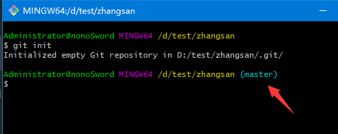

然后，新建一个`index1.html`的文件，并写入`hello world`;

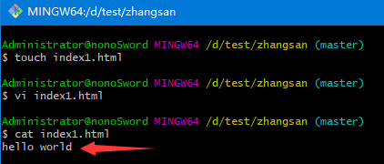

在`master`分支下，提交这次更改到本地库

```git
git add index1.html
git commit -m "creat index1.html"
```

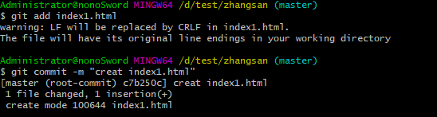

接下来开始使用分支，先创建一个名为`dev`(develop) 的分支，

```git
git branch dev
```

切换到`dev`分支上；

```git
git checkout dev
```

也可以通过以下方式创建并切换分支；

```git
git checkout -b dev
```

git会提示我们创建了`dev`的分支并切换到了`dev`分支下

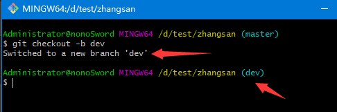

此时git 的分支表现为

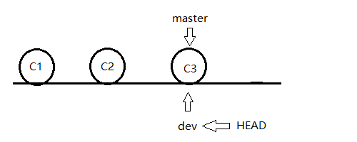

#### 3.使用分支进行开发

在`dev`分支下我们修改`index1.html`为`hello git`并提交到本地库，

```git
git add index1.html
git commit -m "update index1.html world->git"
```

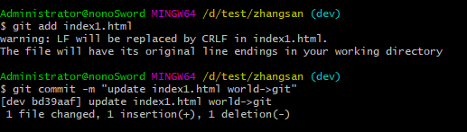

切换回`mater`分支，查看`index1.html`，可以发现内容仍然为`hello world`，由此实现了不同分支的单独开发。

```git
git checkout master
cat index1.html
```

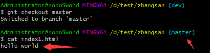

此时git的分支表现为

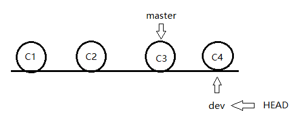

#### 4.合并分支

上述一番操作之后，我们如何将`dev`上的改动合并到`master`呢？

首先我们切换到`master`分支，然后执行合并操作，并查看`index1.html`的情况

```git
git merge dev
cat index1.html
```

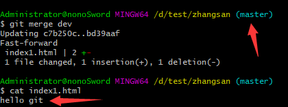

可以看到此时分支合并成功，此时git的分支表现为

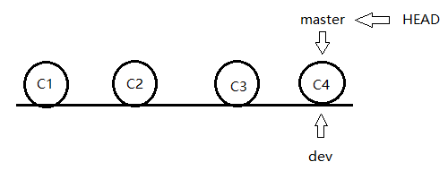

#### 5.分支的冲突

当你在`dev`上修改了`index1.html`并且切换到`master`分支准备合并时，缺发现合并不了，这是因为你的同事A在master分支也提交了一次`index1.html`的修改，这时就会产生分支冲突。

分支冲突的产生主要是由于分工不明确产生的，产生之后只能进行手动修改并重新提交。这里不再赘述，请参考[https://www.liaoxuefeng.com/wiki/896043488029600/900004111093344](https://www.liaoxuefeng.com/wiki/896043488029600/900004111093344)

---

### 三.多人开发的分支管理

#### 1.一般情况下分支的配置

在实际开发中我们常常会使用如下的分支：

1. **master**:主要是拿来发布稳定的用户版本

2. **develop**:主要是拿来发布每一次大版本（如某beta版）

3. **Feature**:功能分支，程序员主要在这个分支上进行开发，必须从dev创建，开发完成后合并回dev

4. **Release**:主要是从dev上创建，然后修改版本号等信息并合并到dev，也可以修复一些极小的BUG

5. **hotfix**:主要是修改正式版本的BUG，从master创建并合并到mater

6. **other**:个人的分支，只在本地进行操作
   
   **在这篇文章中，我们主要使用`master`和`dev`分支进行演示，以免太过繁琐。**
   
   

#### 2.多人开发流程

准备工作：

在test文件夹下，我们初始化`zhangsan`、`lisi`、`remote`三个git本地库，分别视作张三、李四、远程库。

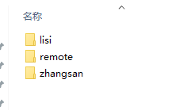

在远程库中，新建`index1.html`、`index2.html`，分别写入`hello world`、`hello git`并提交，然后在远程库中新建一个dev分支，远程库的搭建完毕。

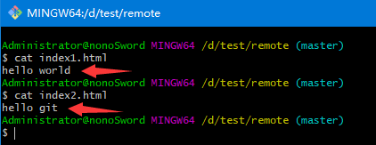

现在两位同事克隆远程仓库，

```git
git clone /d/test/remote
```

可以看到克隆成功，并且克隆时自动给本地库配置了`origin`远程库地址

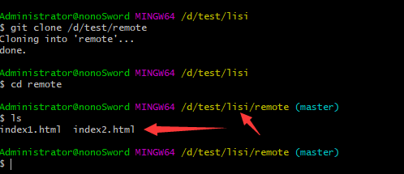

克隆完成后发现只有远程库的`master`分支，但是我们通过`checkout`能直接与远程库进行同步`dev`分支。

```git
git checkout dev
```

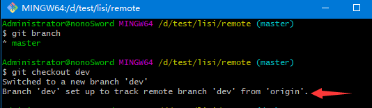

在准备工作完成之后，张三同事现在正式开始开发了，

按照流程，即使`dev`分支被同步到了张三的本地库，他也不能对其直接进行操作，于是他先新建了一个`zs`分支，折腾了一天之后往`index1.html`中写了一行代码`hello zhangsan`，然后提交了到了`zs`分支。

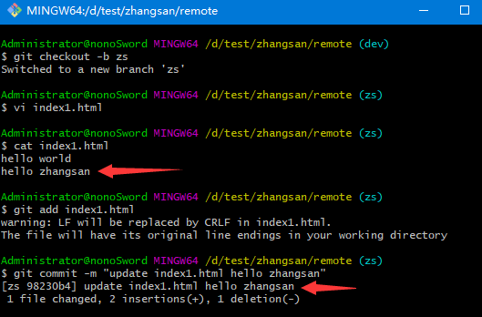

切换到`dev`分支后，对`zs`进行合并，合并完成后删除`zs`分支，最后推送到远程库并且下班走人。

```git
git checkout dev
git merge zs
git branch -d zs  #删除分支
git push
```

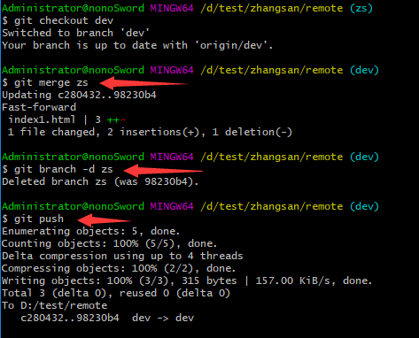

我们可以看到远程库的`dev`分支已经有了改动

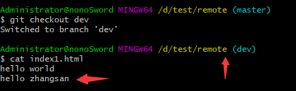

张三顺利下班，但李四就没这么顺利了。

李四也按张三的操作对`index2.html`进行修改，但是到最后一步出现了问题，

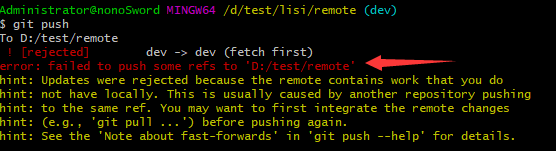

这是因为远程库中`dev`已经被张三提交了一次，所以远程库的`dev`是平行于李四的本地`dev`分支的，git提示你可以先对`dev`分支进行拉取操作然后在本地合并之后再进行推送（合并时会让你输入信息）。

```git
git pull #拉取远程库dev分支
git merge ls
git branch -d ls
git push #将合并后的dev推到远程库
```

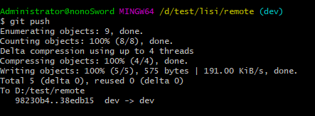

将远程库切换到`dev`分支查看文件信息

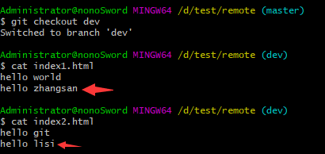

成功实现多人同时开发。

#### 3.总结：

步骤总结：

1. 克隆远程仓库

2. 拉取远程库dev分支

3. 新建个人分支进行开发

4. 开发完毕后再次拉取远程库dev分支

5. dev分支合并新建的个人分支

6. （如果有冲突要手动排除冲突）

7. 删除个人分支

8. 推送dev分支到远程库

9. 下班走人

**第二天开始无需克隆远程仓库**
