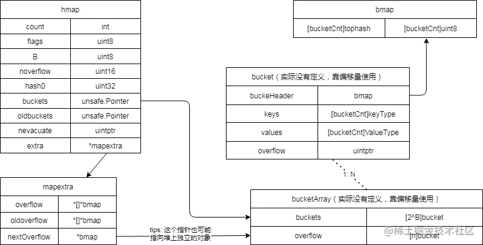

# map

## 底层结构
1. count：已存储的kv数
2. B：常规桶的数目为2的多少次幂
3. buckets：桶结构的指针
4. oldbuckets：迁移阶段，保存旧桶的指针
5. nevacuate：即将迁移的旧桶编号
6. noverflow：已经使用的溢出桶的数量
7. extra
   1. overflow：已经使用的溢出桶指针数组
   2. oldoverflow：旧桶使用的溢出桶
   3. nextoverflow：下个空闲溢出桶

## 桶bmap结构
1. tophash*8：8个哈希值的高8位
2. k*8：8个key
3. v*8：8个value
4. overflow：bmap类型指针，指向溢出桶

## 扩容策略
1. count/(2^B) > 6.5 -> 翻倍桶数目进行扩容
2. overflow较多 -> 等量桶数目扩容(用于大量键值对被删除的情况)
   1. B<=15 && noverflow>=2^B
   2. B>15 && noverflow>=2^15

## 碰撞处理
1. map中一个桶能存放8个元素，当元素hash到同一个桶时，会现在桶内寻找剩余的位置，使用线性探测，同时保存hash值高8位用于下次快速比较
2. 桶中8个位置用满之后，会沿着overflow指针将数据保存到溢出桶中