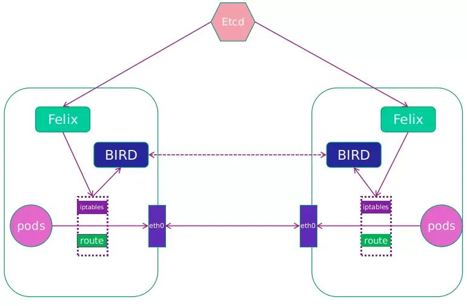

# calico

## 主要工作组件
1. Felix：核心组件，运行在每个节点上。主要功能为接口管理、路由规则、ACL规则和状态报告。Felix会监听ETCD，从中获取节点创建，Pod创建等事件。用户创建Pod后，Felix负责初始化容器网络，并配置宿主机路由规则。如果用户指定了隔离策略，Felix也会将隔离策略创建到ACL中。
2. etcd：可与k8s公用，主要负责维护网络元数据信息
3. calico api server：使用户能直接通过kubectl来配置calico，而不用直接操作etcd
4. BGP Client(BIRD)：每个节点均有一个BIRD，负责读取Felix的路由信息读入内核，并通过BGP协议在集群中分发
5. BGP Router Reflector(RR)：为了避免BIRD形成全网mesh导致规模受限，所有的BIRD可以仅与RR相连接，减少网络连接数
6. calicoctl：calico命令行管理工具

## 工作应用
1. Calico数据库：用于存储calico所需的数据，支持使用etcd或者kube-apiserver
2. calico/node：运行在每个节点上的calico-agent，管理节点上的网络接口，并为容器分配和释放ip地址
3. typha：calico中央控制平面，从kube-apiserver中获取网络策略，并将其分发给所有节点的上的calico/node

