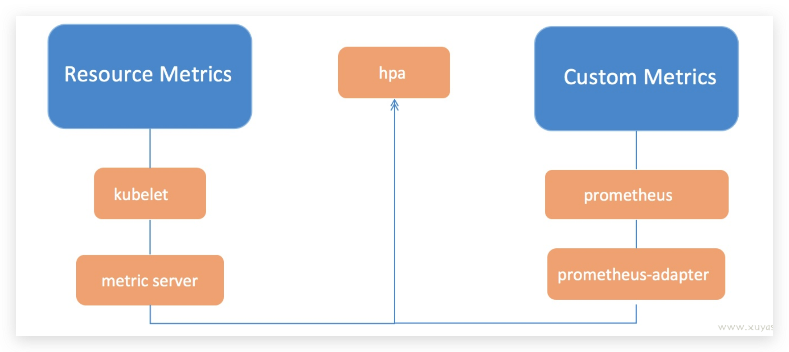

# 监控

## 监控类型
1. 资源监控：CPU、内存、网络等资源类的监控，常以数值、百分比为单位进行统计，是最常见的资源监控方式
2. 性能监控：应用的内部监控，如监视JVM等应用基础性能的指标
3. 安全监控：针对安全进行的一系列监控，如越权管理、安全漏洞扫描等
4. 事件监控：针对k8s中资源相关事件的监控

## 监控数据来源
1. k8s核心指标：包括了Pod、Node、容器、Service等主要Kubernetes核心概念的Metrics，由kubelet集成cAdvisor提供接口
2. 用户自定义指标：由第三方监控应用(一般使用prometheus)采集并管理的一系列指标
   1. k8s核心组件指标：包括了k8s核心组件的监控指标，是检查k8s工作状态的主要依据，由各组件提供/metrics接口
   2. k8s资源元数据：包括Deployment、Pod的名字标签，副本状态等，由kube-state-metrics提供/metrics接口
   3. 宿主机指标：需要以DaemonSet的形式在宿主机上部署NodeExporter，NodeExporter会采集宿主机上的数据，提供/metrics接口
   4. 应用自定义指标：包括了用户应用程序提供的自定义指标，由应用程序提供/metrics接口
3. 外部指标：集群外部应用提供的指标接口

## 监控方案
1. metrics-server：最基本的k8s监控应用。主要用于收集kubelet提供的监控指标，实现metrics.k8s.io资源接口供`kubectl top`命令使用
2. PrometheusOperator(或PrometheusDeployment)和PrometheusAdaptor：利用Prometheus实现的高可用监控方案。由Prometheus收集kubelet指标和用户自定义指标，实现`metrics.k8s.io`和`custom.metrics.k8s.io`资源接口
3. kube-prometheus：基于Prometheus实现的一整套监控、展示、报警方案。在PrometheusOperator和PrometheusAdaptor监控方案上额外添加了若干的组件用于其他功能

## 资源组已经对应的后端服务
| 接口名           | API Group               | 后端服务                                           | 注释                                                      |
| ---------------- | ----------------------- | -------------------------------------------------- | --------------------------------------------------------- |
| Resource Metrics | metrics.k8s.io          | metrics-server                                     | k8s核心指标                                               |
| Custom Metrics   | custom.metrics.k8s.io   | Prometheus和(PrometheusAdaptor+kube-state-metrics) | 用户自定义指标，如k8s组件指标、宿主机指标、应用自定义指标 |
| External Metrics | external.metrics.k8s.io | 外部应用、云厂商的Provider等                       | k8s集群外部应用监控指标，如云产品                         |

## metrics-server和kube-state-metrics的区别
1. metrics-server主要关注资源调度相关资源，比如CPU、内存使用率，文件描述符、请求延时等
2. kube-state-metrics主要关注k8s资源相关的源数据，比如Deployment、Pod的名字标签，副本状态等