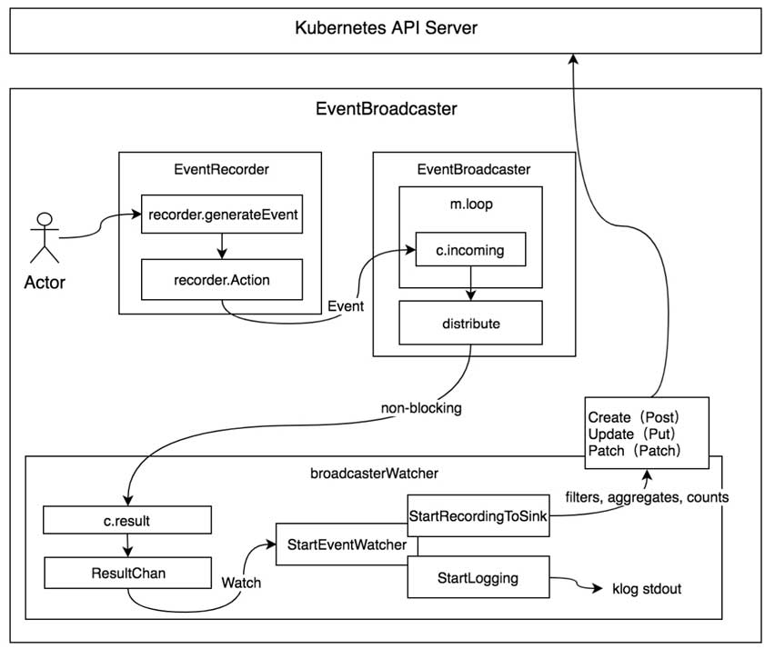

# Event
k8s的Event是一种资源对象，用于展示集群内发生的情况。Event存储在ETCD中，为避免磁盘空间被占满，故强制执行保留策略：在最后一次事件发生时，删除1小时前的事件

## 结构体
```go
type Event struct {
	metav1.TypeMeta `json:",inline"`
	metav1.ObjectMeta `json:"metadata" protobuf:"bytes,1,opt,name=metadata"`

	InvolvedObject ObjectReference `json:"involvedObject" protobuf:"bytes,2,opt,name=involvedObject"`
	Reason string `json:"reason,omitempty" protobuf:"bytes,3,opt,name=reason"`
	Message string `json:"message,omitempty" protobuf:"bytes,4,opt,name=message"`
	Source EventSource `json:"source,omitempty" protobuf:"bytes,5,opt,name=source"`
	FirstTimestamp metav1.Time `json:"firstTimestamp,omitempty" protobuf:"bytes,6,opt,name=firstTimestamp"`
	LastTimestamp metav1.Time `json:"lastTimestamp,omitempty" protobuf:"bytes,7,opt,name=lastTimestamp"`
	Count int32 `json:"count,omitempty" protobuf:"varint,8,opt,name=count"`
	Type string `json:"type,omitempty" protobuf:"bytes,9,opt,name=type"`
	EventTime metav1.MicroTime `json:"eventTime,omitempty" protobuf:"bytes,10,opt,name=eventTime"`
	Series *EventSeries `json:"series,omitempty" protobuf:"bytes,11,opt,name=series"`
	Action string `json:"action,omitempty" protobuf:"bytes,12,opt,name=action"`
	Related *ObjectReference `json:"related,omitempty" protobuf:"bytes,13,opt,name=related"`
	ReportingController string `json:"reportingComponent" protobuf:"bytes,14,opt,name=reportingComponent"`
	ReportingInstance string `json:"reportingInstance" protobuf:"bytes,15,opt,name=reportingInstance"`
}
```
1. 事件分为两种
   1. `EventTypeNormal string = "Normal"`：普通事件
   2. `EventTypeWarning string = "Warning"`：警告事件

## 事件管理机制设计

1. Actor：可以是k8s中的任何组件
2. EventRecorder：事件记录器，Event生产者
3. EventBroadcaster：事件广播器，Event消费者。EventBroadcaster消费EventRecorder记录的事件，并将其广播给所有已连接的broadcasterWatcher。分发机制分为非阻塞和阻塞两种分发机制。
4. broadcasterWatcher：用于定义事件的处理方式