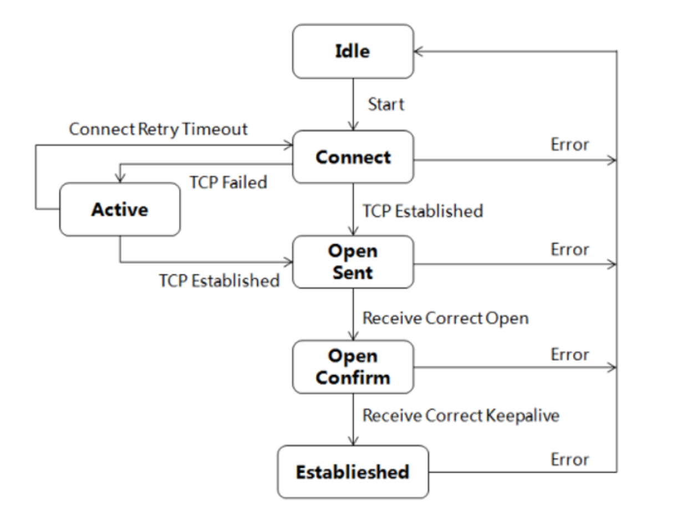

# GBP协议

## 概述
1. 外部网关协议
2. 使用TCP作为传输层协议
3. 支持CIDR
4. 增量更新
5. 路径矢量路由协议
6. 无环路
7. 路由策略丰富
8. 可防止路由震荡
9. 易于扩展

## 核心概念
1. AS号：长度4B
2. 邻居关系：两台路由器之间，只要能进行TCP通信，就能形成邻居关系
   1. EBGP：两台路由器分属不同的AS，一般要求直连
   2. IBGP：两台路由器属于同一个AS，不要求直连

## 特点
1. 是一种实现AS和AS之间路由交换的路由协议
2. 路径矢量路由协议
3. 增量更新：只在BGP启动时交换一次完整的路由信息，后续路由更新报文只通行网络变化信息
4. BGP路由同时携带通路向量防止环路，即经过的AS列表(AS-Path)
5. 周期性发送Keepalive报文，保持与对等体的连接
6. 邻居有EBGP和IBGP之分
7. 传输层用的承载协议是TCP的179端口

## 防环
AS中的路由器在传递路由信息时，将会在路由信息上添加上自己的AS号，如果某个路由器收到带有自己所在AS号的路由信息，将停止将其继续传递并丢弃

## 报文类型
1. Open报文：协商BGP参数
2. Update报文：交换路由信息
3. Keeplive报文：保持邻居关系
4. Notification报文：差错通知
5. Route-Refresh报文：在改变路由策略后请求对等体重新发送路由信息

## BGP状态机

## BGP属性
在BGP路由表中，到达同一个目的地可能存在多条路由，BGP将会选择最佳路由发送给BGP邻居。BGP根据属性来选择最佳路由
1. 公认必须遵循：所有的BGP设备都必须识别该属性，并且存在于Update报文中，缺少此类信息将会报错
2. 公认任意：所有的BGP设备都必须识别该属性，不要求存在Update报文中，缺少此类信息不会报错
3. 可选非过滤：BGP设备都可以不识别该属性，可以不将其发送给邻居
4. 可选过渡：BGP设备都可以不识别该属性，会将其发送给邻居

| 属性名         | 类型         |
| -------------- | ------------ |
| Origin属性     | 公认必须遵循 |
| AS_Path属性    | 公认必须遵循 |
| Next_Hop属性   | 公认必须遵循 |
| Local_Pref属性 | 公认任意     |
| MED属性        | 可选非过渡   |
| 团体属性       | 可选过渡     |
| Originator_ID  | 可选非过渡   |
| Cluster_List   | 可选非过渡   |

1. Origin：来源，标记一条信息如何称为BGP路由
   1. IGP：最高优先级，手动通过network命令定义，标识符i
   2. EGP：通过EGP协议学习的路由，已废弃，标识符e
   3. Incomplete：通过其他方式学习的路由信息，例如路由引入，标识符i
2. AS_Path：路径，标记信息传递经过的AS号
3. Next_Hop：记录路由的下一跳信息
4. Local_Pref：作用在AS内部，路由器iBGP的优先级，用于判断流量离开AS的优选路由，值大的优先，默认100
5. MED：作用在AS之间，路由器eBGP的优先级，用于判断流量进入AS的优选路由，值小的优先
6. 团体：标识具有相同特性的BGP路由，使路由策略更加灵活

## 最佳路由选择
1. 优选协议首选值(PrefVal)最高的路由。PrefVal是华为设备的特有属性，仅在本地有效
2. 优选Local_Pref最高的路由
3. 依次优选
   1. 手动聚合路由
   2. 自动聚合路由
   3. network命令引入路由
   4. import-route命令引入路由
   5. 从对等体学习的路由
4. AS_Path最短的路由

## 路由反射器