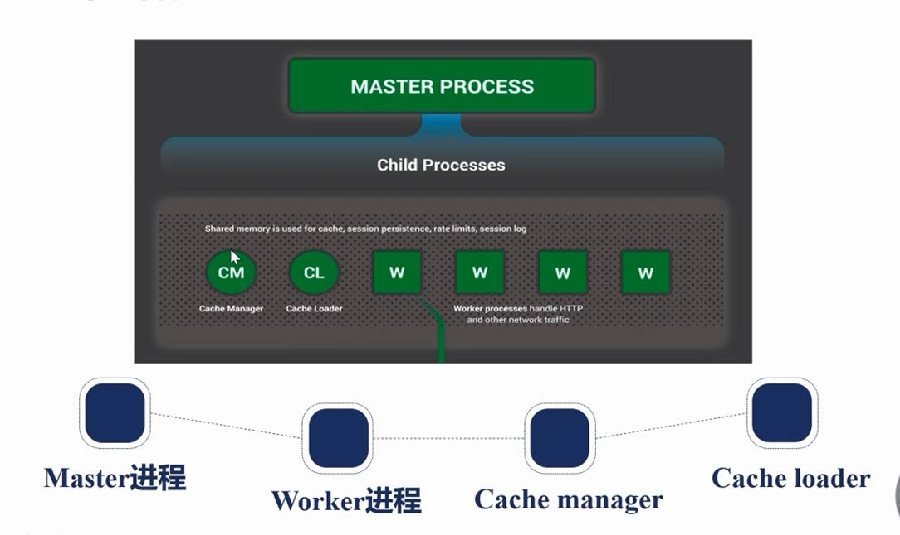
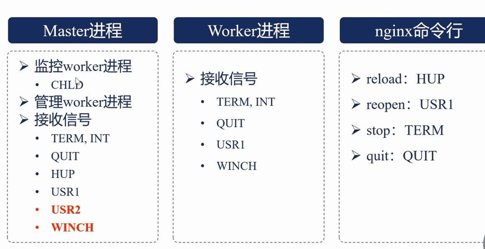

# Nginx

1. ### nginx的进程结构：
   1. 单进程结构：
      
      适用于开发环境（一般是关闭的）
   
   2. 多进程结构：
      
      
      
      - Master Process：父进程，管理Work进程，第三方模块一般不会在其中添加代码
      
      - Child Process：子进程
        
        - Work相关进程：处理请求的进程，将每一个Work与每个CPU绑定
        
        - Cache相关进程：在多个进程中共享
          
          - Cache Manager：缓存管理
          
          - Cache Loader：缓冲载入
   
   3. 通过信号管理nginx的父子进程：
      
      
      
      1. master进程
         
         1. 监控worker进程：当子进程终止时会向父进程发送CHLD信号，master会重新拉起worker
         
         2. 管理worker进程
         
         3. 接收信号
            
            1. TERM、INT：立刻停止nginx进程
            
            2. QUIT：优雅的停止nginx进程
            
            3. HUP：重载配置文件
            
            4. USR1：新打开日志文件，用于切割
            
            5. USR2：用于热部署
            
            6. WINCH：用于热部署
      
      2. worker进程
         
         1. 接收信号：
            
            1. TERM、INT
            
            2. QUIT
            
            3. USR1
            
            4. WINCH
         
         2. 一般不向worker发送信号，因为一般通过master来管理worker
      
      3. nginx命令行
         
         1. reload：HUP
         
         2. reopen：USR1
         
         3. stop：TERM
         
         4. quit：QUIT
2. ### Reload的流程：
   1. 向master发送HUP信号（reload命令）
   
   2. master校验配置文件语法是否正确
   
   3. master打开新的监听端口（如果新增）
   
   4. master进程用新配置启动worker进程
   
   5. master进程向worker发送QUIT信号
   
   6. 老worker进程关闭监听语句，再处理完成当前请求结束进程
3. ### 热升级的流程
   1. 将旧的nginx替换成新的nginx文件（注意备份）
   
   2. 向master2发送USR2信号
   
   3. master进程会修改pid文件名，加上后缀.oldbin
   
   4. master进程会用新的nginx文件启动新的master进程
   
   5. 新master进程会自动启动新worker进程
   
   6. 向老的master发送WINCH信号，关闭老的worker
   
   7. 回滚：向老的master发送HUP，向新的master发送QUIT
4. ### worker进程：优雅的关闭
   1. 设置定时器：worker_shutdown_timeout
   
   2. 关闭监听句柄
   
   3. 关闭空闲连接
   
   4. 再循环中等待所有连接退出
   
   5. 退出进程
5. ### nginx的模块

